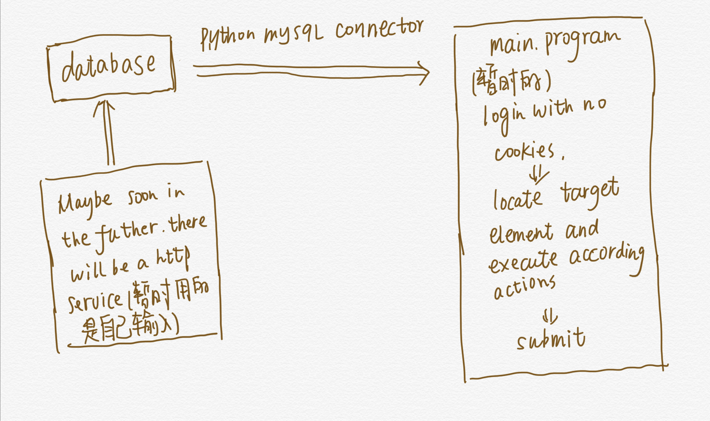
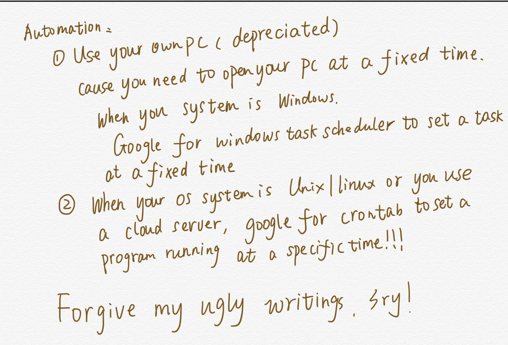

# WebAutomation
This repository is mainly for storing my  automation code, which fill the health report  every day.\
This code is currently only for zju's site. If I have time I will add some other school's site.

Above is the rough frame work.And below will teach you how to automate this work through a daemon.

### Tips
* If you don't want to use database, you could store username and password in a local file(not recommend for security reasons)

* Remember to add headingless options to webdriver when you run this program under systems with no graphic interface.

* Some times the website will request for a https licence otherwise it will return ssl error,Just ignore it and it has no effects on our program cause the server end will not reset the connection like google :laughing:.

* If there is any problem, please raise an issue to inform me of that.
